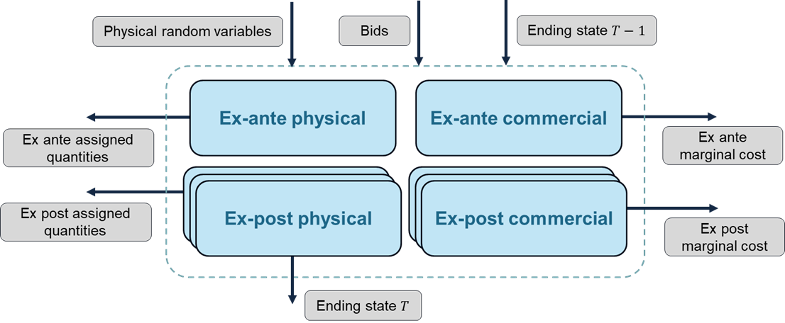

# Clearing Formulation

One of the [key features](key_features.md) of IARA is the organization of the Market Clearing process into four subproblems: Ex-Ante Physical, Ex-Ante Commercial, Ex-post Physical, and Ex-post Commercial.

The typical structure according to which these four subproblems are structured is illustrated in the image below. Note that each iteration of the market clearing process involves solving all four subproblems (one instance of each of the ex ante subproblems and several instances of each of the ex post subproblems, one for each subscenario). The ending state of the previous period's optimization problem ($T-1$) is an input for all four subproblems, and the present period ($T$)'s ending state is also passed on to the next iteration of the market clearing process. Note that it is the final state of one of the instances of the ex post physical optimization problem that will typically be the driver of this ending state.

Other arrows in the diagram below represent other input data (physical random variables and submitted bids) that are collected as part of [IARA's main market clearing process](key_features.md#the-market-clearing-process), as well as output variables (assigned quantities and marginal costs). Converting the assigned quantities and marginal costs into a price signal is part of IARA's post-processing feature.

Even though the above diagram is the "default" structure for the market clearing process, which is quite flexible and able to accommodate a number of market designs, some market design choices might either omit some of these steps or introduce relationships between the subproblems. You can [get started](tutorial/first_execution.md) by exploring IARA's features for representing market design options that will affect the clearing process.

## Clearing Procedures

### Ex-Ante

The Ex-Ante step is responsible for calculating the physical and commercial dispatches one day before the actual operation. The Ex-Ante step is divided into two steps: Ex-Ante Physical and Ex-Ante Commercial. 
In the Virtual Reservoir, the allocation of predicted inflows for this agent is added to its balance.

### Ex-Ante Physical

The Ex-Ante Physical step is responsible for calculating the physical generation amount that will be dispatched a day before the actual operation. The physical units are calculated based on the bids submitted by the agents and the constraints of the system. In the Virtual Reservoir, the allocation of predicted inflows for this agent is added to its balance.
In this problem, the Market Clearing is calculated with all integer variables, and the result will generally be used in other subsequent problems.

### Ex-Ante Commercial

The Ex-Ante Commercial step is responsible for determining the clearing prices of the day-ahead market.

There are three approaches to calculate these prices:

1. **Post-MIP Solution Approach**: After solving the Mixed-Integer Program (MIP), the binary variables are fixed according to the solution, and the resulting Linear Program (LP) is solved. The dual solution of this LP provides the clearing prices.

2. **LP with Fixed Binary Variables**: This approach involves solving the LP that is derived by fixing the binary variables to specific values. Currently, the values of the binary variables are taken from the solution of the ex-ante physical problem.

3. **Relaxation of Integrality Constraints**: In this method, the integrality constraints of the MIP are relaxed, and the resulting LP is solved to determine the clearing prices.

### Ex-Post

In ex-post problems, a set of sub-scenarios can be provided for each scenario verified in the ex-ante, representing shocks that simulate real-time variations. Each scenario can have their own set of sub-scenarios, but the number of sub-scenarios must be the same for all scenarios.

The first sub-scenario calculated in the ex-post is used to transmit the state variable information and the virtual reservoir balance to the next period.

At a given period, the Virtual Reservoir balance is added to the ex-post inflow allocation for this agent in its balance, and the bids accepted by the Operator are debited. After this operation, an adjustment can be made so that the Virtual Reservoir balance equals the Available Energy of the hydros that make up this reservoir.

### Ex-Post Physical

The Ex-Post Physical step is responsible for calculating the physical generation amount that will be dispatched in real-time. The physical units are determined based on the bids submitted by the agents and the system's constraints. In the Virtual Reservoir, the allocation of inflows for the agent is added to its balance.

The binary variable can be handled in the following ways:

1. **Post-MIP Solution Approach**: The Mixed-Integer Program (MIP) fixes the binary variables, and then the program is run with these variables fixed.

2. **LP with Fixed Binary Variables**: The Linear Program (LP) uses binary variables that are fixed based on the solution from a prior problem, such as the ex-ante physical or commercial problem.

3. **Relaxation of Integrality Constraints**: The LP is run with relaxed integrality constraints, allowing for continuous variables instead of discrete binary variables.

### Ex-Post Commercial

Ex-Post Commercial

The Ex-Post Commercial step is responsible for calculating the clearing prices of the real-time market.

There are three approaches to calculate these prices:

1. **Post-MIP Solution Approach**: The Mixed-Integer Program (MIP) fixes the variables, and then the program is run with these variables fixed.

2. **LP with Fixed Binary Variables**: The Linear Program (LP) receives binary variables that are fixed based on the solution of a prior problem. These variables can come from either the ex-ante or ex-post physical problems.

3. **Relaxation of Integrality Constraints**: The LP is run with relaxed integrality constraints, allowing for continuous variables instead of binary ones.

In all procedures, it's possible to add the FCF from the MinCost module and a wave-guide curve as a tie-break for the Virtual Reservoir bids.

## Model Clearing model types

The Market Clearing can be calculated in three ways:

1. Cost Based Dispatch: The dispatch is calculated based only on the physical attributes of the system. The objective is to minimize the total cost of the system. No bids are considered in this case.
2. Bid Based Dispatch: The dispatch is calculated based only on the bids submitted by the agents. The objective is to minimize the total cost of the bids accepted by the Operator. The physical constraints are not considered in this case.
3. Hybrid Dispatch: The dispatch is calculated based on the bids submitted by the agents and the physical constraints of the system serve as a limit for the accepted bids and a tie-break for the bids with the same cost. The objective is to minimize the total cost of the bids accepted by the Operator.

Any step of the Market Clearing can be calculated with any of the three model types described above.

## Standard Reservoir settlement

This is a post processing feature related to the revenue of the agents that isn't related to Virtual Reservoirs.
Notation:
- $\omega \in \{\text{ex-ante}, \text{ex-post}\}$: subproblem types.
- $q^{\omega}$: primal variable representing the quantity of energy dispatched in the ex-ante or ex-post physical subproblem.
- $\pi^{\omega}$: dual variable representing the marginal costs in the ex-ante or ex-post commercial subproblem.

The revenue of the agents is calculated as follows:

| Settlement Type | Expression |
| --------------- | ---------- |
| EX_POST | $q^{\text{ex-post}} \pi^{\text{ex-post}}$ |
| EX_ANTE | $q^{\text{ex-post}} \pi^{\text{ex-ante}}$ |
| DOUBLE  | $q^{\text{ex-ante}} \pi^{\text{ex-ante}}+(q^{\text{ex-post}}-q^{\text{ex-ante}} ) \pi^{\text{ex-post}}$ |

- The default file for **generation** is the *Physical* Problem. If this file is unavailable due to being skipped,
  the model will use the *Commercial* Problem instead, but a warning will be generated to indicate a non-standard execution type.
- The default file for **marginal costs** is the *Commercial Problem*. If this file is unavailable due to being skipped,
  the model will use the *Physical Problem* instead.
- In **EX_ANTE** or **DOUBLE** settlements, if both the *Ex Ante Physical* and *Ex Ante Commercial* Problems or
  both *Ex Post Physical* and *Ex Post Commercial* Problems are skipped, an error will occur.
- In **EX_POST** settlements, if both the *Ex Post Physical* and *Ex Post Commercial* Problems are skipped, an error will occur.

