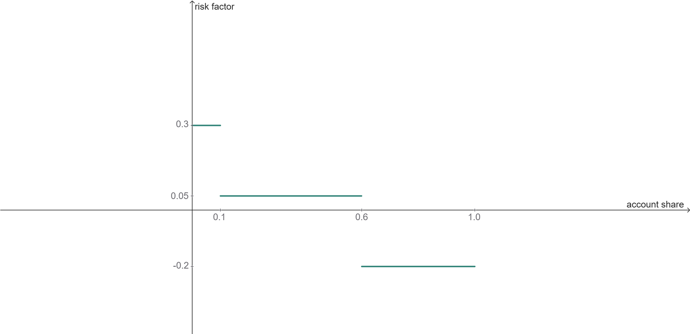
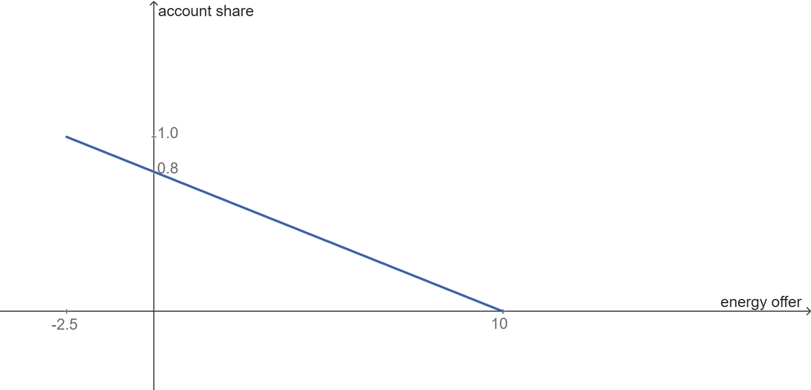
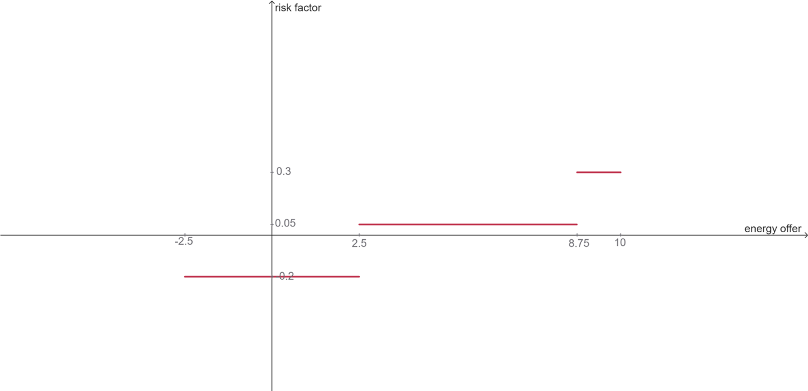
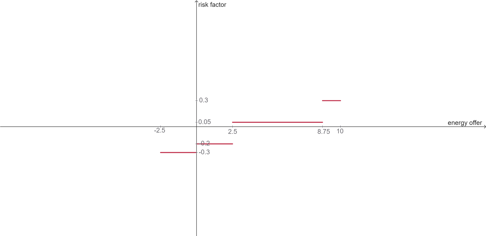
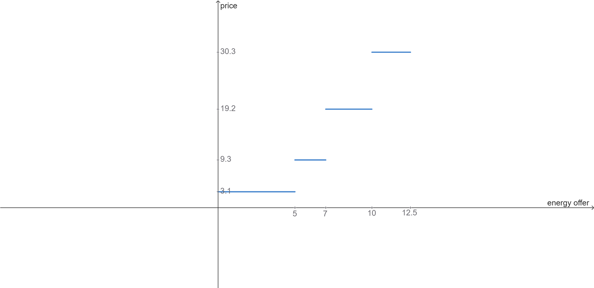
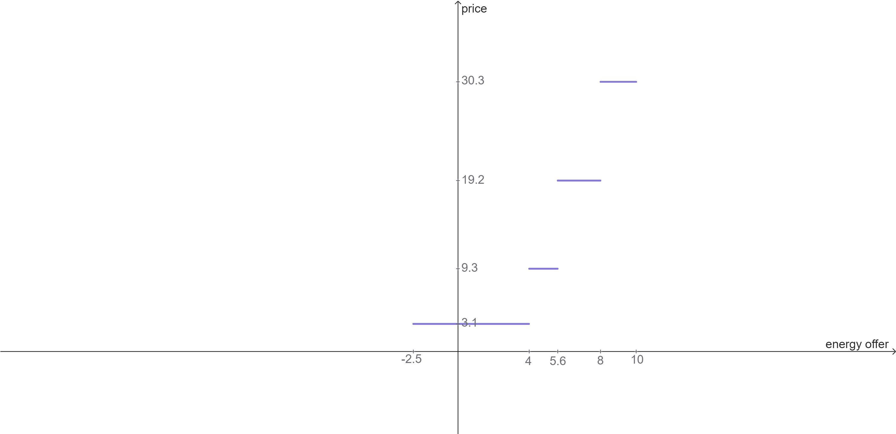
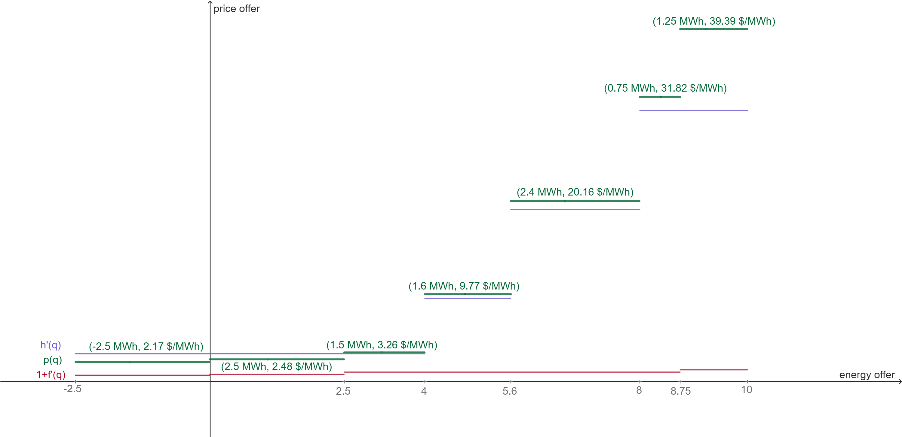

# Hydro reference curve 

The hydro reference curve seeks to draw the aggregate offer curve for each virtual reservoir for a given period and scenario, defining price and quantity levels. These results are later used for the heuristic bidding of virtual reservoirs

The maximum energy generation in the period and scenario is determined by the amount of stored energy and the turbine limits of the reservoirs. The set of multipliers $\Theta$, in the interval $0 < \theta \le 1$, is applied to the maximum amount of available energy. For each value of the multiplier $\theta$, a single optimization model $P(\theta)$ is run, which returns the price levels $\mu_r^*$ and quantity $q_r^*$ for each virtual reservoir in the scenario considered.

Based on these results, the price and quantity segments corresponding to the multiplier $\theta$ are defined for each reservoir $r$:

- $\mu_r(\theta) = \mu_r^*$, which represents the price for the multiplier $\theta$.

- $q_r(\theta) = q_r^* - \sum_{\vartheta \in \Theta, \vartheta < \theta}{q_r(\vartheta)}$, which defines the quantity for the multiplier $\theta$.

For each virtual reservoir $r$, this process generates two vectors: one for the price levels $M_r$ and one for the quantities $Q_r$. The vectors are ordered in ascending order of price, which is important for constructing the heuristic bid later. The last segment of quantities is extended to reach the total stored energy, as it can be greater than the maximum turbinable energy.

The variables, constraints, objective function, and parameters of the $P(\theta)$ problem are presented below. Additional symbols are defined in the [Market Clearing Problem](#market-clearing-problem) and [Centralized Operation Problem](#centralized-operation-problem) sections.

## Sets
- ``\Theta``: Set of reference curve multipliers.
- ``C``: Set of future cost cutting planes coefficients.

## Parameters
- ``\bar{q}_r(\omega)``: Available energy of virtual reservoir $r$ for current period, scenario $\omega$. Calculated as the minimum between the total stored energy at $r$ and the maximum turbinable energy at $r$ considering the period duration.


## Variables
- ``q_r``: Total energy generated by virtual reservoir $r$ at period.
- ``\alpha``: Future cost.

## Objective Function

```math
    \min \; \alpha\\
```

## Constraints

### Future Cost Cuts
```math
    \alpha \ge \sum_{j \in J^H_{VR}} m_j \cdot v_{j, |B(t)|+1} + b \quad \forall (m, b) \in C
```

### Physical-Virtual Coupling

```math
    \sum_{\tau \in B(t)}{\sum_{h \in J^H_{VR}(r)} g^H_{h, \tau} } = q_r \quad :\mu_r \quad \forall r \in J^{VR}
```

### Generation reference

```math
    \sum_{r \in J^{VR}} q_r = \theta \cdot \sum_{r \in J^{VR}} \bar{q}_r(\omega)
```

### Non-decreasing Generation Reference

```math
    q_r \ge \sum_{\vartheta \in \Theta, \vartheta < \theta} q_r(\vartheta)
```

### Hydro Balance

```math
    v_{j, \tau+1} = v_{j, \tau} - u_{j, \tau} - z_{j, \tau}
    + \sum_{n \in J^H_U(j)}{u_{n, \tau}} 
    + \sum_{n \in J^H_Z(j)}{z_{n, \tau}} +  a_{j, \tau} + a^S_{j, \tau} \\
    \quad \forall j \in J^H_{VR}, \tau \in B(t)
``` 

# Heuristic bid for virtual reservoir

For each asset owner $i$ in the virtual reservoir $r$, the heuristic bid is constructed based on the hydro reference curve $[Q_{r, p}, M_{r,p}]_{p \in P}$, the pairs of reference and markup $(s_{i,f}, p_{i,f})_{f \in F^{AO}(i)}$, the purchase discount rate $o_i$, and the energy accounts $E^{in}_r$.

The available parameters for the heuristic bid are either input data or results from the market clearing problem. They are defined as follows:

- $F^{AO}(i)$: Set of risk factors for asset owner $i$.
- $G$: Set of points on the hydro reference curve.
- $s_{i,f}$: Maximum account share at which the risk factor $p_{i,f}$ is applied for asset owner $i$, with $s_{i,f} > s_{i,f+1}$, $s_{i,1} > 0$, and $s_{i, |F^{AO}(i)|} = 1$.
- $p_{i,f}$: Risk factor for asset owner $i$ at level $f$.
- $o_i$: Purchase discount rate for asset owner $i$.
- $E^{in}_{r,i}$: Energy account of asset owner $i$ in virtual reservoir $r$.
- $M_{r, g}$: Price at point $g$ of the hydro reference curve for virtual reservoir $r$.
- $Q_{r, g}$: Quantity at point $g$ of the hydro reference curve for virtual reservoir $r$.

The calculation of the heuristic bid for virtual reservoir $r$ can be split into three steps:

1. Adjusting the pairs of reference and markup $(s_{i,f}, p_{i,f})_{f \in F^{AO}(i)}$ into pairs of energy quantity and markup $(s'_{i,f}, p_{i,f})_{f \in F^{AO}(i)}$.
2. Adjusting the hydro reference curve for each asset owner $i$, based on the energy accounts.
3. Applying the adjusted markup vectors to the adjusted hydro reference curve to obtain the heuristic bid for asset owner $i$.


## Adjust markup vectors for asset owner $i$

The markup vectors for asset owner $i$ form a set of pairs $(s_{i,f}, m_{i,f})_{f \in F^{AO}(i)}$, where $s_{i,f}$ is the maximum share of the energy account at which the risk factor $m_{i,f}$ is applied. The image below illustrates the markup vectors for an asset owner, where $(s_{i,f}, m_{i,f})_{f \in F^{AO}(i)} = \{(0.1, 0.3), (0.6, 0.05), (1.0, -0.2)\}$.



We want to find the relation between the energy offer and the risk factor. For that, we look for the relation between the energy offer and the share of the energy account. The following calculated parameters are used:

- $E_{r,i}$: Energy account of asset owner $i$ in virtual reservoir $r$, considering the initial energy account and the inflow, $E_{r,i} = E^{in}_{r,i} + e^{inflow}_r \cdot \gamma^{VR}_{r,i}$, where $e^{inflow}_r$ is the inflow energy of virtual reservoir $r$ and $\gamma^{VR}_{r,i}$ is the inflow share of asset owner $i$ in virtual reservoir $r$.
- $T$: Sum of the energy accounts of all asset owners in the virtual reservoir $r$, $T = \sum_{i \in I^{VR}(r)} E_{r,i}$.
- $S_i$: Share of the energy account of asset owner $i$ in the virtual reservoir $r$, calculated as $S_i = \frac{E_{r,i}}{T}$.
- $j_{S_i}$: Index of the first risk factor above the share $S_i$ of asset owner $i$. $j_{S_i} = \min\{f \mid s_{i,f} \ge S_i\}$.
- $n_i$: Number of risk factors for asset owner $i$, $n_i = |F^{AO}(i)|$.

The energy account share as a function of the energy offer is $s(q) = \frac{E_{r,i} - q}{T} = S_i - \frac{q}{T}$.

For our example, considering $S_i = 10$, $T=12.5$, the image below shows the graph of the function.



If $f(s)$ is the risk factor as a function of the share $s$, then $f(s(q))$ will give us the risk factor as a function of the energy offer $q$. Intuitively, we take the graph of the function $f(s)$, mirror it on a vertical axis so the domain remains the same, stretch it to the right by a factor of $T$, and then shift it to the left by $T - E_{r,i}$. The image below shows the graph of the function $f(s(q))$ for our example.



Additionally, for the negative side of the energy offer, we apply the purchase discount rate $o_i$ to the risk factor, which is $o_i = 0.1$ in our example. The image below shows the final graph of the risk factor as a function of the energy offer for our example.



The pair of vectors $m', s'$ representing the risk factors and the energy offer segments for asset owner $i$ are defined as follows:

$$
\{(s'_{i,f}, m'_{i,f})\}_{f \in F^{AO}(i)} = \begin{bmatrix}
    -(s_{i, n_i} - s_{n-1}) \cdot T & & m_{i, n_i} - o_i \\
    -(s_{i, n_i-1} - s_{n-1}) \cdot T & & m_{i, n_i-1} - o_i \\
    \vdots & & \vdots \\
    -(s_{i, j_{S_i}+1} - s_{i, j_{S_i}}) \cdot T & & m_{i, j_{S_i}+1} - o_i \\
    -(s_{i, j_{S_i}} - S_i) \cdot T & & m_{i, j_{S_i}} - o_i \\
    (S_i -  s_{i, j_{S_i}-1}) \cdot T & & m_{i, j_{S_i}} \\
    (s_{i, j_{S_i}-1} -  s_{i, j_{S_i}-2}) \cdot T & & m_{i, j_{S_i}-1} \\
    \vdots & & \vdots \\
    (s_{i, 2} -  s_{i, 1}) \cdot T & & m_{i, 2} \\
    (s_{i, 1} -  0) \cdot T & & m_{i, 1} \\
\end{bmatrix}
$$

Note that the energy offer segment $(s'_{i,f})$ represents the length of the corresponding segment in the graph. This way, for our example, where $j_{S_i} = 3$, the pair of vectors for asset owner $i$ is $s'_{i,f} = \{-2.5, 2.5, 6.25, 1.25\}$ and $m'_{i,f} = \{-0.3, -0.2, 0.05, 0.3\}$.

## Adjust hydro reference curve for asset owner $i$

The hydro reference curve for virtual reservoir $r$ is defined as a set of points $G_r = \{(Q_{r,g}, M_{r,g})\}_{g \in G}$, where $Q_{r,g}$ is the quantity and $M_{r,g}$ is the price at point $g$. The image below illustrates the hydro reference curve for virtual reservoir $r$.



We want to adjust the hydro reference curve for asset owner $i$ to let it be proportional to the energy account of asset owner $i$: 

$$
q'_{r,i,g} = Q_{r,g} \cdot S_i
$$

Also, we want to have a price for buying energy, so we extend the hydro reference curve to the negative side of the energy offer. This is done by adding a segment with the same price as the first point of the hydro reference curve, but with a quantity equal to the negative difference between the energy account of asset owner $i$ and the sum of energy accounts:

$$
q'_{r,i,0} = E_{r,i} - T \quad \text{and} \quad M'_{r,i,0} = M_{r,1}
$$

The image below shows the adjusted hydro reference curve for asset owner $i$.



The vectors that represent the adjusted hydro reference curve for asset owner $i$ are defined as follows:

$$
\{(q'_{r,i,g}, M'_{r,i,g})\}_{g \in G'} =  \begin{bmatrix}
    E_{r,i} - T & & M_{r,1} \\
    Q_{r,1} \cdot S_i & & M_{r,1} \\
    Q_{r,2} \cdot S_i & & M_{r,2} \\
    \vdots & & \vdots \\
    Q_{r,|G|-1} \cdot S_i & & M_{r,|G|-1} \\
    Q_{r,|G|} \cdot S_i & & M_{r,|G|} \\
\end{bmatrix}
$$

where $G' = G \cup \{0\}$.

## Apply adjusted markup vectors to adjusted hydro reference curve

Once we have the reference price and the markup for each quantity segment, we can construct the heuristic bid for asset owner $i$. The image below shows the adjusted hydro reference curve $h'(q)$, the adjusted markup curve, shifted 1 unit up, $1 + f'(q)$, and the heuristic bid $p(q) = h'(q)\cdot(1+f'(q))$. 



To calculate the vectors that represent the quantity bidding segments for asset owner $i$, we get the vectors of the adjusted hydro reference curve $q'_{r,i,g}$ and the adjusted markup energy offer segments $s'_{i,f}$.

Based on the quantity segments $q'_{r,i,g}$, we define the segment boundaries $Q'_{r,i,g}$, where the price $M'_{r,i,g}$ is applied in the interval $[Q'_{r,i,g}, Q'_{r,i,g+1})$. The boundaries are defined as follows:

$$
Q'^+ = \left[\sum_{g \in G', g \le h} q'_{r,i,g}\right]_{h \in G', q'_{r,i,h} > 0} \\
Q'^- = \left[\sum_{g \in G', g \ge h} q'_{r,i,g}\right]_{h \in G', q'_{r,i,h} < 0} \\
Q' = \left[ Q'^-; 0; Q'^+ \right]
$$

We do the same for the adjusted markup segments $s'_{i,f}$, defining the boundaries $S'_{i,f}$ as follows:

$$
S'^+ = \left[\sum_{f \in F^{AO}(i), f \le h} s'_{i,f}\right]_{h \in F^{AO}(i), s'_{i,h} > 0} \\
S'^- = \left[\sum_{f \in F^{AO}(i), f \ge h} s'_{i,f}\right]_{h \in F^{AO}(i), s'_{i,h} < 0} \\
S' = \left[ S'^-; 0; S'^+ \right]
$$

This way, the boundaries that represent the quantity offer at the heuristic bid are defined by $\{Q_{r,i,k}^{VR}\}_{k \in K(r, i)} =  Q' \cup S'$.

To find the quantity offer of each segment $k$, we calculate:

$$
q^{VR}_{r,i,k} = Q^{VR}_{r,i,k+1} - Q^{VR}_{r,i,k}
$$

And for the price at the segment $k$, we calculate as follows:

$$
P^{VR}_{r,i,k} =
\max_g\{M'_{r,i,g} \mid Q'_g \le Q^{VR}_{r,i,k}\} \;\cdot \; \left(1+\max_{f}\{m'_{i,f} \mid S'_f \le Q^{VR}_{r,i,k} \}\right)
$$


# Supply Safety Agent

The **Supply Safety Agent** is a special type of asset owner that acts as a safeguard for the system. If present, the following conditions must be met:

- It must be associated with every virtual reservoir $r$ in the system.
- It cannot be associated with any bidding group, meaning it does not own any units.
- For each virtual reservoir $r$, the inflow share of the supply safety agent must be zero, i.e., $\gamma^{VR}_{r, i} = 0$.

The role of the supply safety agent is to mitigate risks arising from the actions of other asset owners in the virtual reservoir. If the other asset owners in the virtual reservoir $r$ are selling too much energy at a low price, this could deplete the reservoir too quickly, creating a risk of failing to meet future demand. In such cases, the supply safety agent will place **buying offers** at a price higher than or equal to the prices of the other asset owners, effectively increasing its own energy account and reducing the rate at which water is withdrawn from the reservoir.

Conversely, if the other asset owners are selling energy at excessively high prices, the supply safety agent will place **selling offers** at lower prices, ensuring fairer prices for consumers.

The determination of "too cheap" and "too expensive" is based on the future cost of water, ensuring the agent's actions are aligned with the long-term sustainability of the system.

The markup vectors for the supply safety agent must be defined to generate this desired behavior.