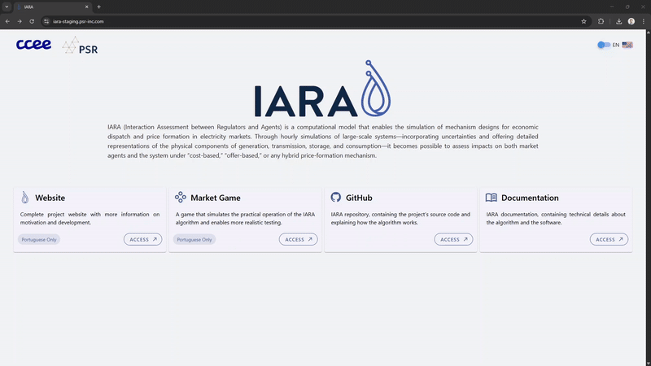
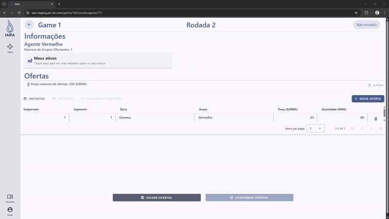
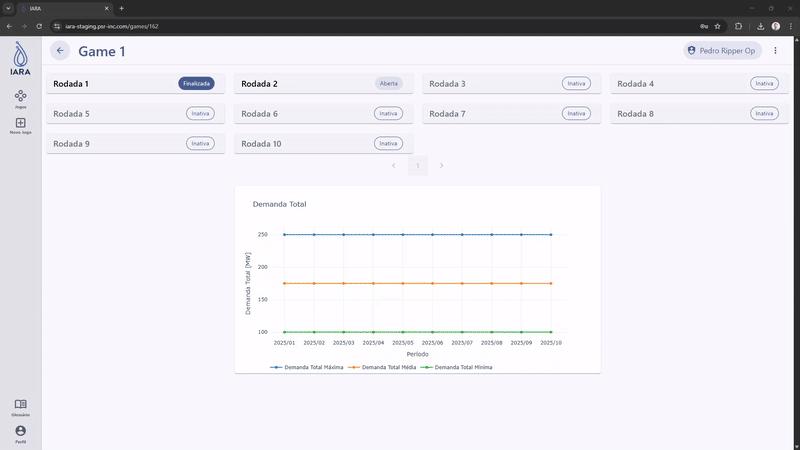
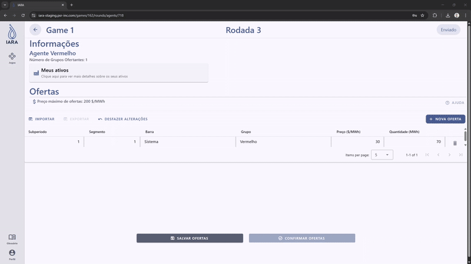
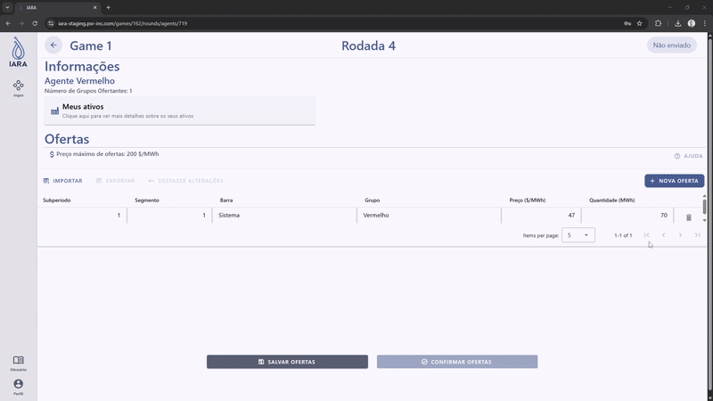
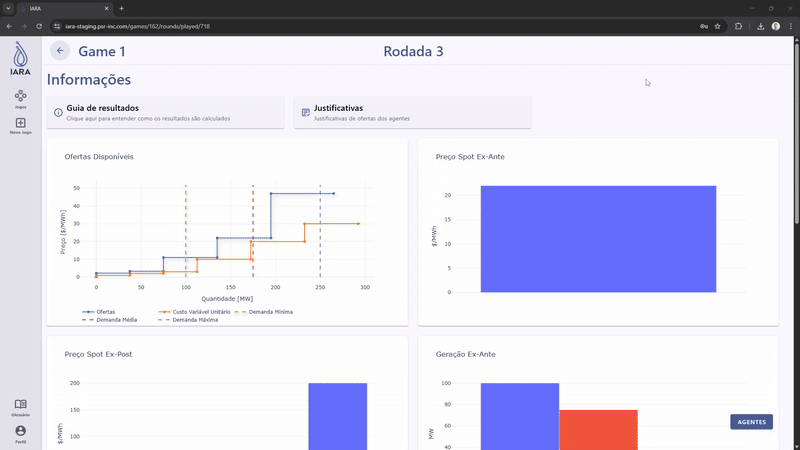

# IARA Platform

As discussed in this documentation, IARA.jl uses several concepts from electricity markets, which can be complex to understand.
That said, along with IARA.jl, we have developed a web platform called [IARA Platform](https://iara.psr-inc.com/) that allows users to participate in an energy market simulation, where they can play the role of an Asset Owner or System Operator.
For now, the IARA Platform is only available in Portuguese.

In a game, each user is assigned to an Asset Owner by the System Operator, who is responsible for executing the optimization problem after all users have submitted their bids.
A user's bid, which consists of a quantity and price offer, should be chosen by the user based on their knowledge of the market and their assets.

## Single Period Market Clearing

In the [Key Features](key_features.md#the-market-clearing-process) section, we explained IARA.jl's Market Clearing Process, which optimizes the dispatch of assets based on the bids submitted by asset owners.
In this case, the problem's time horizon can vary and have multiple time steps, which are depicted by the `period` and `subperiod` dimensions.
Additionally, the `subperiod` duration can vary and is defined by the `subperiod_duration` parameter during the formulation of the problem.

In the web platform, however, in order to simplify the user experience, we consider the notion of a game being comprised of rounds, where each round is treated a a single period.
This single period is then divided into subperiods, each representing one hour of the day.

When executing a round, IARA.jl performs the single period market clearing process by calling the [`IARA.single_period_market_clearing`](@ref) function, which considers the bids submitted by the users for the current round and outputs specialized plots for the web platform.
The results of the market clearing process are then displayed to the users, allowing them to visualize the dispatch of assets and the prices determined by the market.

## Features

### Price Violation

The IARA Platform includes a validation routine that checks if the price offers submitted by the users are within the allowed range for their assets.
In this documentation you can find more information about how the price limits are calculated by IARA.jl.

There are two main price thresholds that are considered in the validation routine:
1. **Non justified offer**: If the price offer is below this limit, the user is not required to justify their offer. 
However, if the price offer is above this limit, the user must provide a justification for their offer in a text box.

2. **Justified offer**: If the price offer is above this limit, the user cannot submit their offer, even if they provide a justification.

After the round is executed, the System Operator can review the justifications provided by the users in the results section.

