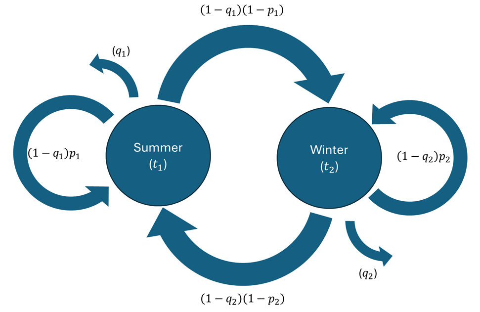

# Introduction: Policy graph

The best way to learn is by doing - we ecourage you to explore the tutorial for [building](tutorial/case_06_build_policy_graph.md) and [running](tutorial/case_06_run_policy_graph.md) a database with a more complex policy graph structure.

## The temporal structure and a visual representation of cyclicality

When [building a case from scratch](build_a_case_from_scratch.md), creating the temporal structure using the language of the policy graph is one of the first necessary steps. The following study parameters are used in practice to guide the construction of the policy graph: 

- `number_of_subperiods`
- `subperiod_duration_in_hours`
- `expected_number_of_repeats_per_node`
- `cycle_duration_in_hours`
- `cycle_discount_rate`
- `policy_graph_type`

A visual representation of the cyclicality between seasons is represented in the image below (for a simple example that only includes two seasons, Summer and Winter). Note the relationship between the parameters displayed in the picture and the parameters input to the database:

- `t` represents the duration of each season's "representative subproblem", which depends on the `number_of_subperiods` and `subperiod_duration_in_hours` parameters.
- `q` represents a probability that the simulation will "terminate" after solving a season's "representative subproblem", which is used in practice to represent a discount rate (future periods are valued less because there is a probability that they will never be reached). This parameter is calculated based on the `cycle_discount_rate` and the `cycle_duration_in_hours`, and it also depends on the duration `t`.
- `p` represents the probability that the same season will repeat once again after the season's "representative subproblem" is solved, provided that the simulation does not terminate. This parameter is calculated based on the `expected_number_of_repeats_per_node`.

Note that the probability that the simulation will move forward to the next season is fully given by the parameters `p` and `q`: if the simulation does not terminate and the current season does not repeat, the only remaining alternative is to move forward to the next season. This structure generalizes easily to a case with more than two seasons: in a 12-season model used to represent typical months, after each January (for example) there are only three possibilities: either the simulation terminates (with probability `q`), or the typical month of January will "repeat" in the next period, implying that January typical month data will be used once again as the input (with conditional probability `p`), or the simulation will move forward and the following period will be represented with probability distributions representative of the typical month of February.

## Linear and cyclic policy graphs

The `policy_graph_type` parameter's goal is to choose whether the intertemporal optimization will consider a *cyclic* representation (IARA's default) or a *linear* one.

- In a **cyclic** policy graph, the periods are connected in a cyclic sequence: there is one "future cost function" per *season*, and the decisions made in the last season will affect the decisions in the first season.
- In a **linear** policy graph, the periods are connected in a linear sequence: there is one "future cost function" per *period*, and the decisions made in the last period do not affect any other decisions (as the simulation terminates).

Even in a linear policy graph, the probability of repeating the current season (represented by `p` in the diagram above) is still applied. The key distinction of the linear policy graph representation is that it does not assume cyclicality, and therefore does not impose that the future cost function in the Spring of 2025 is the same as the future cost function in the Spring of 2026, despite these two dates referring to the same season. Even though there are applications in which a linear policy graph can be more suitable, the cyclic policy graph that IARA uses as a default is intended to reduce the number of future cost functions that need to be estimated and accelerate convergence - with the underlying assumption that the system's supply-demand balance does not change substantially along the years to make a significant difference.

For more details on linear policy graphs and cyclic policy graphs, see the [SDDP.jl documentation](https://sddp.dev/stable/tutorial/first_steps/).
